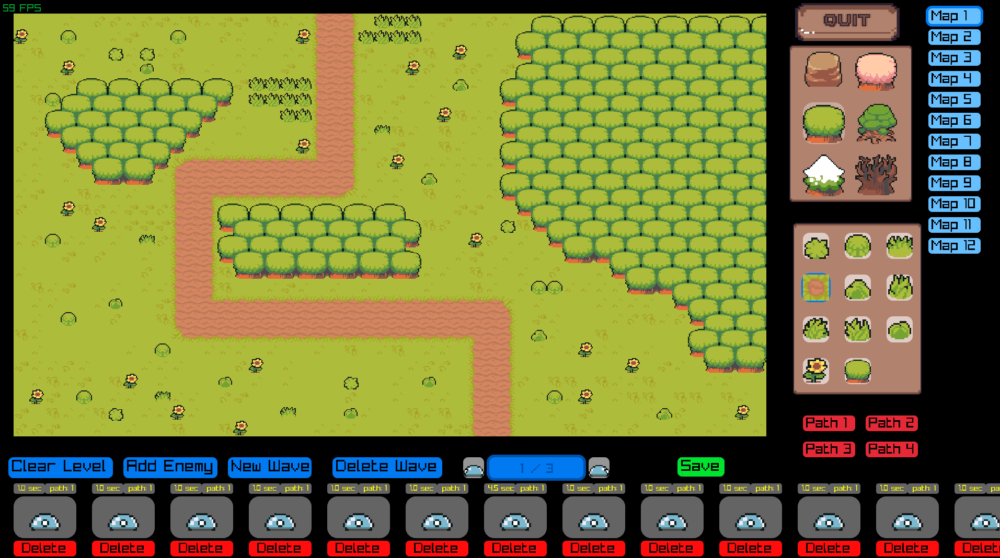
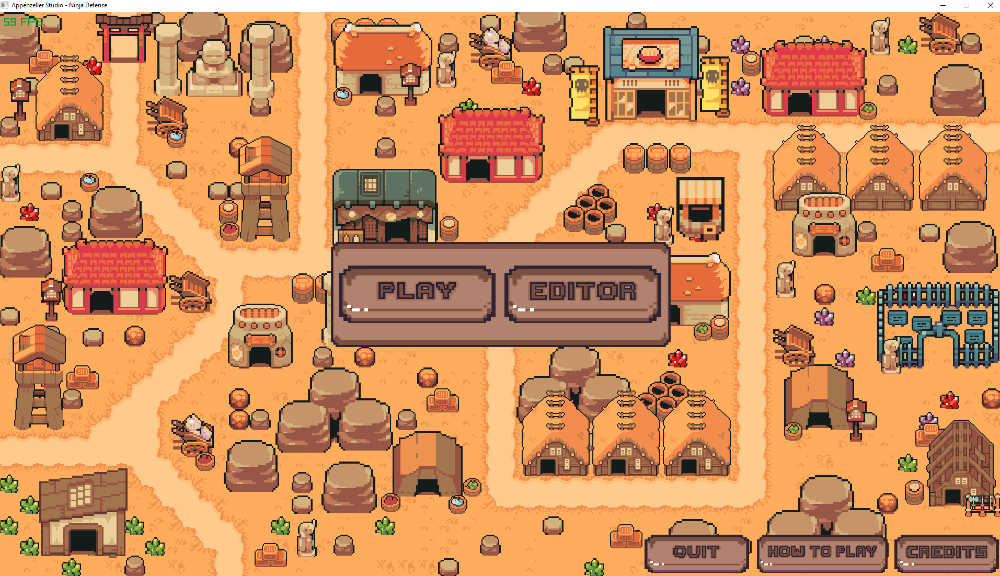
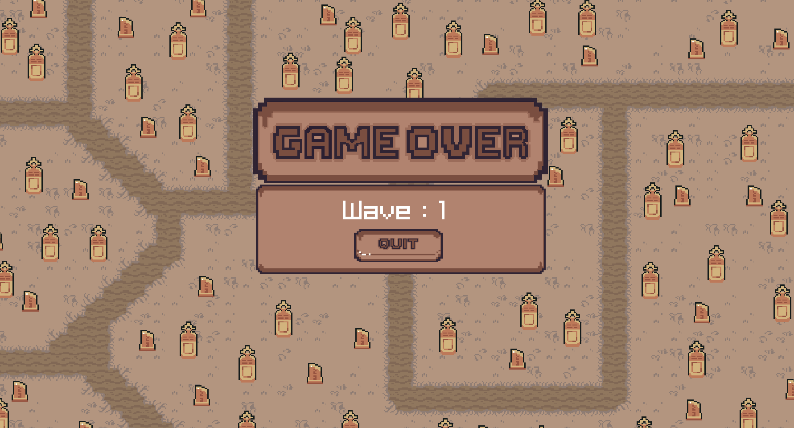
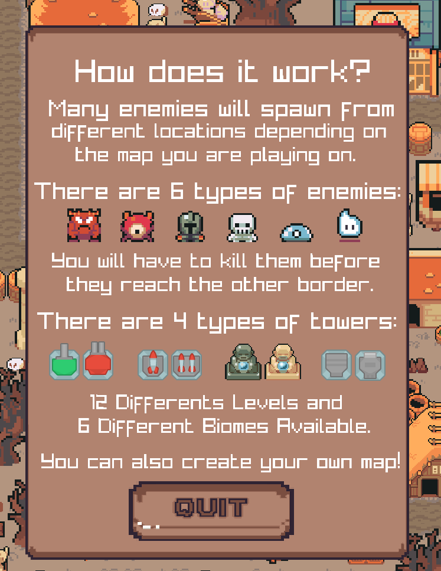
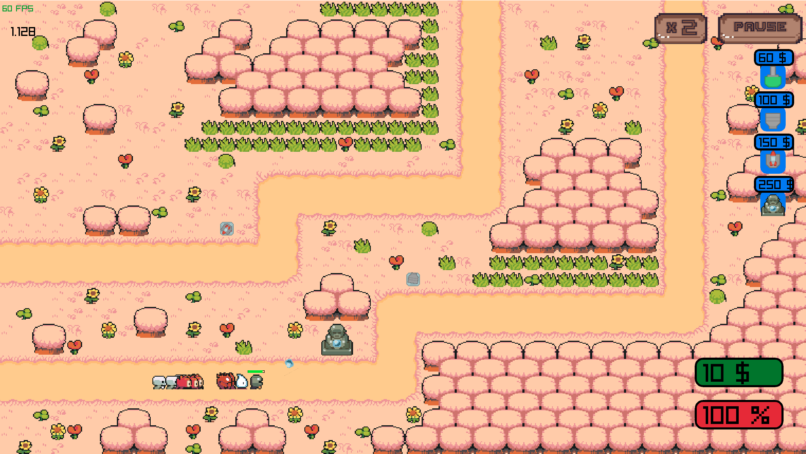
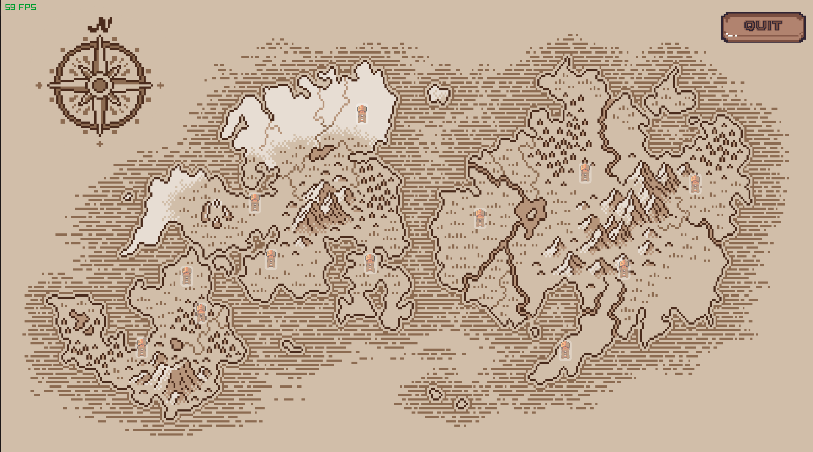
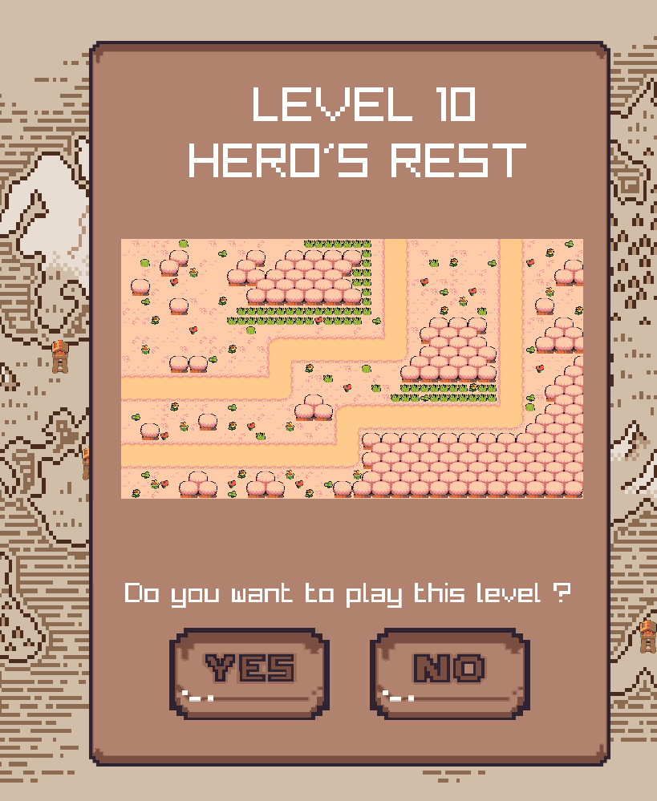

<div align="center">

# TowerDefense
</div>

**This project aims at recreating a tower defense game in C++ language with Raylib library for the visuals.**<br/>
**The second goal of this project is to become more familiar with code structuring and math applied to video games and POO.**

## Information
Project start : 11/23/2021\
Project end : 12/17/2021\
Version : 1.0 - GOLD\
Date last version : 12/17/2021\

## Building
## Create an executable
```sh
$ make
```
## Run
```sh
$ ./TowerDefense
```
## Clean the project
```sh
$ make clean
```

## Game Preview
# EDITOR MENU
- 
# GAME MENU
- 
# GAME OVER MENU
- 
# GAME RULES MENU
- 
# GAME
- 
# GAME PLAY MENU
- 
# LEVEL SELECTED MENU
- 

## Asset Credits
- Asset tower : Kenney https://www.kenney.nl/assets/tower-defense-top-down
- Asset sprite and enemy : Pixel Boy https://pixel-boy.itch.io/ninja-adventure-asset-pack 
- Sound : Pixel Boy https://pixel-boy.itch.io/ninja-adventure-asset-pack
- FX : Pixel Boy https://pixel-boy.itch.io/ninja-adventure-asset-pack
